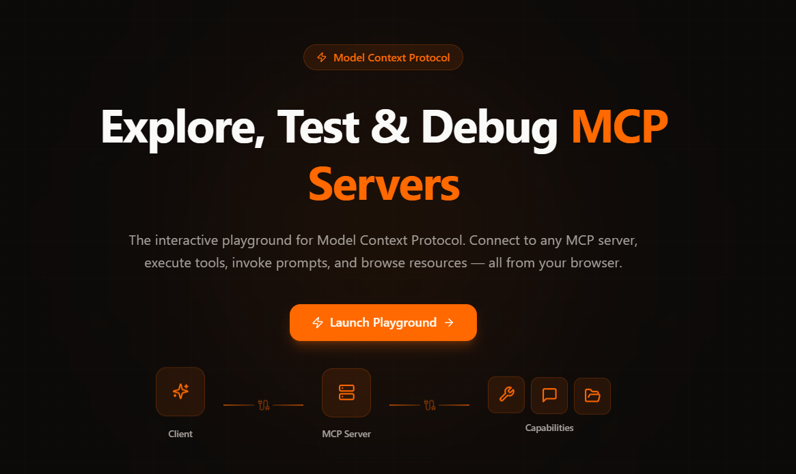
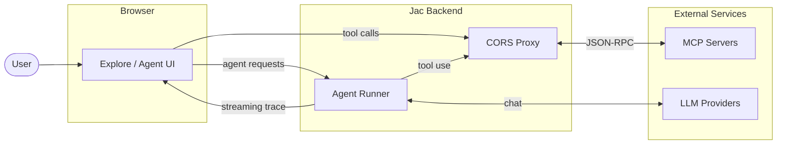

<div align="center">


# ProtoMCP

**Postman for MCP servers — connect, explore, and test from your browser**

[](https://modelcontextprotocol.io)
[](https://jaseci.org)
[](LICENSE)
[](https://github.com/SahanUday/ProtoMCP/stargazers)

[Live Demo](https://protomcp.io/) &nbsp;·&nbsp; [Docs](https://protomcp.io/docs) &nbsp;·&nbsp; [Get Started](#get-started)

<a href="https://protomcp.io/">
  <picture>
    <source media="(prefers-color-scheme: dark)" srcset="./assets/banner-dark.png">
    <source media="(prefers-color-scheme: light)" srcset="./assets/banner-dark.png">
    
  </picture>
</a>

</div>

---

ProtoMCP is a browser-based inspector for MCP servers. Point it at any MCP server — local or remote — and you get a full UI to browse tools, prompts, and resources, fire requests, and watch every JSON-RPC exchange in real time. No extensions, no config files, no local setup required.

## What it does

**Explore Mode** connects to any MCP server over Streamable HTTP or SSE. Once connected, ProtoMCP discovers all capabilities automatically and generates input forms from the server's JSON Schema — so you can invoke tools, preview prompts, and browse resources without writing a single line of code. Every request and response is logged with timing data in a live panel alongside.

**Agent Mode** drops an AI assistant on top of your connected servers. Pick a provider (OpenAI, Anthropic, Gemini, Groq, or others), write a prompt, and watch the agent reason and call tools across all connected servers in real time. You can require confirmation before each tool call if you want to stay in the loop — useful when the tools have side effects.

Multiple servers can be connected at the same time. Tools and resources from all of them are aggregated into a single workspace, so you can mix and match across servers in a single agent session.

## Get Started

**Hosted** — no setup, open in your browser:

**[https://protomcp.io/](https://protomcp.io/)**

**Run locally:**

```bash
pip install jaclang jac-client byllm jac-mcp jasketch-mcp-server
git clone https://github.com/SahanUday/ProtoMCP.git && cd ProtoMCP
jac start main.jac
```

Open [http://localhost:8000](http://localhost:8000). To connect a local MCP server, see the [ngrok tunnel guide](https://protomcp.io/docs/connect_mcp/local).

## Architecture



The Jac backend sits between the browser and remote MCP servers, handling CORS and session management so the UI can talk to any server without browser restrictions. In Agent Mode, the backend runs the ReAct loop, routing LLM calls and tool executions before streaming the trace back to the client.

## Tech Stack

| Layer | Technology |
|---|---|
| Framework | [Jac (Jaseci)](https://jaseci.org) |
| Frontend | jac-client |
| Styling | Tailwind CSS v4 |
| Editor | Monaco Editor |
| LLM routing | byllm |
| Deployment | Kubernetes via jac-scale |

## Roadmap

- **Desktop App** — Native app via [Tauri](https://tauri.app) with direct localhost and stdio transport support. See the [Desktop App docs](https://protomcp.io/docs/desktop_app).

## Contributing

Issues and pull requests are welcome. If you're fixing a bug, open a PR directly. If you're adding something new, open an issue first so we can align on the approach before you build it.

Check [open issues](https://github.com/SahanUday/ProtoMCP/issues) for things tagged `good first issue` or `help wanted`.

## License

MIT — see [LICENSE](LICENSE) for details.

---

<div align="center">

[Live Demo](https://protomcp.io/) &nbsp;·&nbsp; [Docs](https://protomcp.io/docs) &nbsp;·&nbsp; [MCP Specification](https://modelcontextprotocol.io) &nbsp;·&nbsp; [Jaseci Labs](https://github.com/jaseci-labs)

</div>
