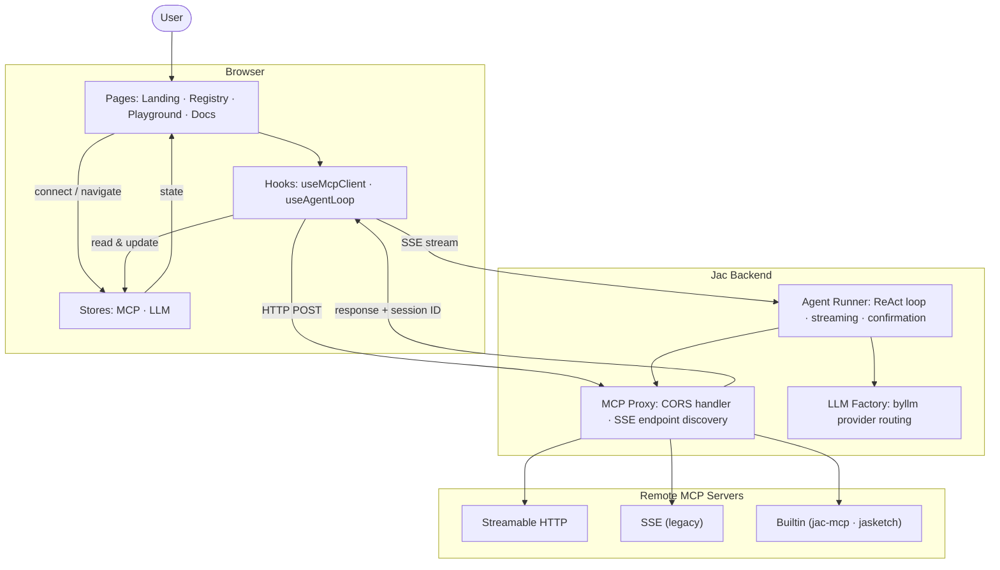

<div align="center">


# ProtoMCP

**A Postman-like web UI for Model Context Protocol servers**

Connect, explore, test, and debug any MCP server directly from your browser. No local setup required.

[](https://modelcontextprotocol.io)
[](https://jaseci.org)
[](LICENSE)
[](https://github.com/jaseci-labs/jac-mcp-playground/stargazers)

[Get Started](#get-started) &nbsp;·&nbsp; [Features](#features) &nbsp;·&nbsp; [Docs](https://protomcp.io/docs) &nbsp;·&nbsp; [Contributing](#contributing)


---

  <p>
    <a href="https://protomcp.io/">
      <picture>
        <source media="(prefers-color-scheme: dark)" srcset="./assets/banner-dark.png">
        <source media="(prefers-color-scheme: light)" srcset="./assets/banner-dark.png">
        
      </picture>
    </a>
  </p>

</div>

## Features

### 🔌 Connect to Any MCP Server
- Enter a server URL and connect in seconds
- Supports **Streamable HTTP** (modern, session-aware) and **SSE** (legacy) transports
- Authentication: Bearer Token, API Key (custom header), Basic Auth, or none
- Built-in servers via `builtin://` protocol (jac-mcp, jasketch) — no URL needed
- Connect to local servers via ngrok tunnel — see [Local Connection guide](https://protomcp.io/docs/connect_mcp/local)
- Multiple servers connected simultaneously; tools aggregated across all

### 🛠 Explore Mode
- **Tools** — Execute server tools with forms auto-generated from JSON Schema
- **Prompts** — Invoke prompts with arguments and preview generated messages
- **Resources** — Browse and preview resources with MIME type detection
- **Live discovery** — All capabilities fetched and displayed instantly on connect
- 3-panel layout: server list · capability explorer · live request logs

See [Explore Mode docs](https://protomcp.io/docs/explore_mode).

### 🤖 Agent Mode
- AI-powered assistant that autonomously uses tools from all connected MCP servers
- Supports all major LLM providers: **OpenAI**, **Anthropic**, **Google Gemini**, **Groq**, **Together AI**, and custom models
- Real-time execution trace: thoughts, tool calls, tool results, token usage, and final responses
- **Tool confirmation mode** — approve or deny each tool call before execution (120s timeout)
- Per-session history (up to 5 sessions), system prompt customization, per-tool filtering, temperature, max tokens, and iteration control

See [Agent Mode docs](https://protomcp.io/docs/agent_mode).

### 📋 Real-Time Request Logs
- Watch every JSON-RPC request and response as it happens
- Timing data per request, visual status indicators (pending / success / error)
- Full history of up to 200 requests with complete payloads

### 🗂 MCP Server Registry
- Browse 16 pre-configured MCP servers built into the app
- Filter by transport (HTTP, SSE) or search by name
- One-click connect to any listed server

### ⚡ Built for Developer Productivity
- Dark mode UI — comfortable for long sessions
- Monaco Editor (same as VS Code) for JSON payload editing
- Session ID persistence — no manual header management
- Built-in CORS proxy — no browser extension needed

## Get Started

### Option 1 — Use the Hosted Version

No setup required. Open ProtoMCP in your browser:

**[https://protomcp.io/](https://protomcp.io/)**

### Option 2 — Run Locally

See the [Quickstart guide](https://protomcp.io/docs/quickstart) for full details.

**Prerequisites**

```bash
pip install jaclang jac-client byllm jac-mcp jasketch-mcp-server
```

**Clone and start**

```bash
git clone https://github.com/SahanUday/ProtoMCP.git
cd ProtoMCP
jac start main.jac
```

Open [http://localhost:8000](http://localhost:8000) in your browser.

## Architecture


## Tech Stack

- **Framework**: [Jac (Jaseci)](https://jaseci.org) — Full-stack language
- **Frontend**: jac-client
- **Styling**: Tailwind CSS v4 with custom theme
- **Editor**: Monaco Editor (VS Code editor component)
- **LLM routing**: byllm (Jaseci stack plugin)
- **Icons**: Lucide React
- **Deployment**: Kubernetes via jac-scale

## Roadmap

- **Desktop App** — Native app via [Tauri](https://tauri.app) with direct localhost and stdio transport support. See [Desktop App docs](https://protomcp.io/docs/desktop_app).

## Contributing

Contributions are welcome and appreciated! Here's how to get involved:

### Reporting Bugs

Search [existing issues](https://github.com/SahanUday/ProtoMCP/issues) first. If it's new, open one with:
- A clear title and description
- Steps to reproduce
- Expected vs. actual behavior
- Browser/OS details if relevant

### Suggesting Features

Open a [GitHub Discussion](https://github.com/SahanUday/ProtoMCP/issues) or an issue tagged `enhancement`. Describe the use case, not just the solution.

### Submitting a Pull Request

1. **Fork** the repository and create a branch from `main`
   ```bash
   git checkout -b feat/your-feature-name
   ```

2. **Set up** your local environment
   ```bash
   pip install jaclang jac-client byllm jac-mcp jasketch-mcp-server
   git clone https://github.com/SahanUday/ProtoMCP.git
   cd ProtoMCP
   jac start main.jac
   ```

3. **Make your changes** — keep commits focused and write clear messages

4. **Test** your changes locally against at least one MCP server

5. **Open a PR** against `main` with:
   - A description of what changed and why
   - Screenshots or a short recording if it's a UI change
   - Reference to the related issue (e.g. `Closes #42`)

### What to Work On

Check the [open issues](https://github.com/SahanUday/ProtoMCP/issues) for things labeled `good first issue` or `help wanted`.

## License

MIT — see [LICENSE](LICENSE) for details.

---

<div align="center">

**[Live Demo](https://protomcp.io/)** &nbsp;·&nbsp; [Docs](https://protomcp.io/docs) &nbsp;·&nbsp; [MCP Specification](https://modelcontextprotocol.io) &nbsp;·&nbsp; [Jac Docs](https://jaseci.org) &nbsp;·&nbsp; [Jaseci Labs](https://github.com/jaseci-labs)

<sub>Built with ❤️ by <a href="https://github.com/jaseci-labs">Jaseci Labs</a></sub>

</div>
